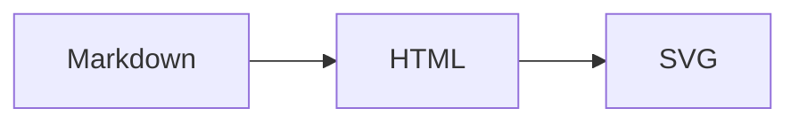

# Go Markdown Server with Mermaid

A small Go web server that renders Markdown files as HTML and renders fenced
`mermaid` code blocks as SVG diagrams in the browser.

This project is forked from
[`mountain-pass/go-markdown-server`](https://github.com/mountain-pass/go-markdown-server).
It keeps the original `gomarkdown` parser and adds self-hosted Mermaid rendering.

## Features

- Markdown-to-HTML conversion with `github.com/gomarkdown/markdown`
- Mermaid flowcharts and other Mermaid diagram types
- Mermaid 11.16.0 bundled with the binary; no CDN or internet connection required
- Automatic Mermaid 10.9.6 fallback for legacy WebViews such as Chromium 83
- Mermaid assets loaded only on pages that contain a `mermaid` code block
- Source-code fallback when JavaScript is disabled or a diagram is invalid
- Clean file-based routes such as `/about` for `content/about.md`
- Responsive light and dark styling
- Minimal `scratch` runtime container
- Optional HTTP security headers, enabled by default

## Mermaid usage

Use a normal fenced code block with the language set to `mermaid`:

````markdown

````

`gomarkdown` converts the fence into a `language-mermaid` code block. The page
then loads the embedded Mermaid library and replaces that block with an SVG.
Other pages do not load Mermaid.

Rendering happens in the browser, so a reasonably modern browser with
JavaScript enabled is required. If rendering fails, the original diagram
source remains visible.

### Legacy WebView compatibility

The server selects the Mermaid bundle in the browser, without relying on a
user-agent string:

- Modern browsers use Mermaid 11.16.0.
- Older browsers that cannot parse Mermaid 11 use Mermaid 10.9.6 and receive
  tiny compatibility shims for `structuredClone`, `Object.hasOwn`, and
  `String.prototype.replaceAll` only when those APIs are missing.

This has been tested with Chromium 83 using a flowchart with Chinese labels,
subgraphs, nested directions, branches, and joined edges. Normal flowchart
syntax—including `flowchart`, `subgraph`, `direction`, node labels, arrows,
classes, and link styles—works in both paths. On the legacy path, Mermaid 11
features are not available, including the `A@{ shape: ... }` expanded-shape
syntax, image/icon nodes, and edge IDs or animations. Modern devices retain
all Mermaid 11 features.

## Quick start with Docker

```bash
docker compose up --build -d
```

Open <http://localhost:8080>.

The Compose configuration mounts `./content` at `/content`. Add Markdown files
and an optional `style.css` to that directory.

To stop the service:

```bash
docker compose down
```

### Docker without Compose

```bash
docker build -t go-markdown-server-with-mermaid:local .
docker run --rm -p 8080:8080 \
  -v ./content:/content:ro \
  go-markdown-server-with-mermaid:local
```

### Multi-platform image

The multi-platform Compose file builds `linux/amd64` and `linux/arm64`.
Override `IMAGE_NAME` with the registry tag you want to publish:

```bash
IMAGE_NAME=your-user/go-markdown-server-with-mermaid:latest \
  docker compose -f docker-compose.multiplatform.yml build --push
```

## Run with Go

Go 1.21 or later is required.

```bash
go run .
```

## Configuration

| Variable | Default | Description |
| --- | --- | --- |
| `PORT` | `8080` | HTTP listen port |
| `CONTENT_DIR` | `./content` | Directory containing Markdown and `style.css` |
| `HTTP_SECURITY_HEADERS` | `enable` | Set to `disable` to turn off the default headers |

Example:

```bash
PORT=3000 CONTENT_DIR=/path/to/content go run .
```

## Routes

- `/` serves `content/index.md`
- `/about` and `/about.md` serve `content/about.md`
- `/docs/` serves `content/docs/index.md`
- `/style.css` serves `content/style.css`
- versioned `/assets/` URLs serve the Mermaid files and compatibility loader
  embedded in the Go binary

As in the upstream project, an unknown Markdown route falls back to
`content/index.md` when that file exists.

## Browser diagnostics

`/__diag/` is a self-contained browser capability probe for troubleshooting
devices that show Mermaid source instead of SVG. It tests progressively newer
JavaScript syntax, same-origin asset access, basic SVG, Mermaid 11 rendering,
and the production initializer. Results are posted back to the server and kept
in an in-memory queue of at most 50 reports; restarting the process clears it.

Use an explicit role in the URL when comparing devices:

- `/__diag/?role=reader_builtin`
- `/__diag/?role=reader_via`
- `/__diag/?role=phone_via`
- `/__diag/?role=desktop`

The latest reports are available as JSON at `/__diag/reports`. The probe does
not request geolocation, camera, microphone, files, or account access. It does
record the browser user-agent because the WebView/Chromium version is directly
relevant to Mermaid compatibility.

## Security notes

- Mermaid uses `securityLevel: "strict"`.
- Mermaid JavaScript and CSS are served from the same origin, which works with
  the default `script-src 'self'` Content Security Policy.
- No inline JavaScript or third-party CDN is used.
- The Markdown renderer allows raw HTML and does not sanitize untrusted input.
  Only serve trusted Markdown, or add an HTML sanitizer before exposing
  user-supplied content.
- Very large or deliberately complex diagrams can consume significant browser
  CPU and memory.

## Project structure

```text
go-markdown-server-with-mermaid/
├── main.go
├── main_test.go
├── go.mod
├── Dockerfile
├── docker-compose.yml
├── content/
│   ├── index.md
│   └── style.css
├── web/
│   ├── mermaid-11.16.0.min.js
│   ├── mermaid-10.9.6.min.js
│   ├── mermaid-modern-syntax-probe.js
│   ├── mermaid-loader.js
│   ├── mermaid-init.js
│   └── mermaid.css
├── testdata/browser/    # Valid and invalid diagrams for browser testing
└── third_party/mermaid/LICENSE
```

## Development and tests

```bash
go test ./...
go build ./...
```

The tests verify conditional asset loading, embedded asset responses, caching,
404 behavior, and compatibility with the default Content Security Policy.

When updating Mermaid, replace the versioned bundle, update the corresponding
paths in the compatibility loader, update the third-party license if necessary,
and run both the Go tests and real-browser rendering tests for a modern browser
and Chromium 83.

## Licenses

The server is distributed under the MIT License in [`LICENSE`](LICENSE).
The embedded Mermaid distribution is also MIT-licensed; its license is kept in
[`third_party/mermaid/LICENSE`](third_party/mermaid/LICENSE).
